# ⚡ Krypt - The Future of Decentralized Payments

> **"Send Crypto Across the World. Instantly. Securely."**

Welcome to **Krypt**, a stunning Web3.0 blockchain application that empowers you to send Ethereum to anyone, anywhere in the world, with a fun and interactive twist!  Built with the power of modern web technologies and the security of the Ethereum blockchain, IS **Krypt** is not just a wallet—it's an experience.

Experience the seamless blend of a sleek, glassmorphism-inspired UI with the robust reliability of smart contracts. Connect your wallet, attach a GIF to your transaction, and watch your value move across the globe in seconds.

---

## 🏗️ System Architecture

Dive into the flow that powers Krypt. This diagram illustrates how your interaction flows from the beautiful client-side application through the Ethereum network and immutable storage.

```mermaid
%%{
  init: {
    'theme': 'base',
    'themeVariables': {
      'primaryColor': '#0d1117',
      'primaryTextColor': '#c9d1d9',
      'primaryBorderColor': '#3fb950',
      'lineColor': '#238636',
      'secondaryColor': '#161b22',
      'tertiaryColor': '#161b22'
    }
  }
}%%

graph TD
    style Client fill:#0d1117,stroke:#58a6ff,stroke-width:2px,color:#58a6ff
    style Wallet fill:#0d1117,stroke:#f0883e,stroke-width:2px,color:#f0883e
    style SC fill:#0d1117,stroke:#3fb950,stroke-width:2px,color:#3fb950
    style Chain fill:#0d1117,stroke:#a371f7,stroke-width:2px,color:#a371f7
    style API fill:#0d1117,stroke:#d29922,stroke-width:2px,color:#d29922

    classDef glowing stroke-width:4px,stroke-opacity:0.8;

    subgraph UserInterface [🖥️ Client Side - React & Vite]
        Client(Web Application)
        Wallet(MetaMask Wallet)
    end

    subgraph BlockchainLayer [⛓️ Blockchain Layer - Ethereum]
        SC(Smart Contract\n Solidity)
        Chain(Ethereum Network)
    end
    
    subgraph External [🌐 External Services]
        API(GIPHY API)
    end

    Client -- "Connects & Signs" --> Wallet
    Wallet -- "Initiates Transaction" --> SC
    SC -- "Records Data" --> Chain
    Client -- "Fetches GIFs" --> API
    Chain -- "Events & Confirmation" --> Client

    click Client href "https://vitejs.dev/" "Vite"
    click SC href "https://soliditylang.org/" "Solidity"
```



---

## 🚀 Key Features

### 💎 **Stunning User Interface**
A fully responsive, mobile-friendly design featuring modern **Glassmorphism** aesthetics. Smooth animations and a dark-themed layout make every interaction feel premium.

### 🔗 **Seamless Wallet Connection**
Connect your MetaMask wallet with a single click. Krypt handles the authentication effortlessly, showing your account details and card instantly.

### 💸 **Instant Crypto Transfers**
Send Ethereum to any address on the blockchain. Real-time updates ensure you know exactly when your transaction is processed.

### 👾 **Interactive GIFs**
Every transaction tells a story! Attach a keyword (like "party" or "coffee") to your transfer, and Krypt uses the **GIPHY API** to attach a relevant, fun GIF to your permanent blockchain record.

### 📜 **Transparent History**
View all latest transactions in a beautiful feed. Because everything is on the blockchain, the history is immutable, transparent, and always accessible.

---

## 🛠️ Technology Stack

*   **Frontend**: [React.js](https://reactjs.org/) + [Vite](https://vitejs.dev/) - Blazing fast build tool.
*   **Styling**: [Tailwind CSS](https://tailwindcss.com/) - Utility-first framework for rapid UI development.
*   **Blockchain Interaction**: [Ethers.js](https://docs.ethers.io/) - A complete Ethereum wallet implementation.
*   **Smart Contract**: [Solidity](https://docs.soliditylang.org/) - Language for implementing smart contracts.
*   **Development Environment**: [Hardhat](https://hardhat.org/) - Ethereum development environment for professionals.
*   **API**: [GIPHY API](https://developers.giphy.com/) - For fetching awesome GIFs.

---

## 📦 Installation & Setup

1.  **Clone the repository**
    ```bash
    git clone https://github.com/Anshuman-Jha/Decentralized-UptimeCheck-web-app.git
    cd Decentralized-UptimeCheck-web-app
    ```

2.  **Install Client Dependencies**
    ```bash
    cd client
    npm install
    ```

3.  **Install Smart Contract Dependencies**
    ```bash
    cd smart_contract
    npm install
    ```

4.  **Run Locally**
    - Start the client: `npm run dev` (in `client` folder)
    - Deploy contract (requires Hardhat setup): `npx hardhat run scripts/deploy.js --network <network>`
